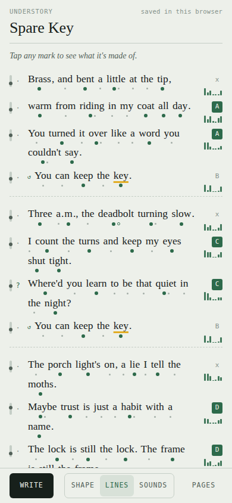

# understory

A web app for songwriters that shows the stress, rhyme and sound structure of a lyric, line by line. It also marks how concrete each line is, which senses it reaches, who speaks and which lines return. A sentence the song never says can sit under a ground line, and the app shows where its words surface. It is plain JavaScript with no language model or backend of its own: rules and three public word lists run in the browser, and every mark opens a receipt showing its source.

**Status: prototype.** It marks stress as a line is spoken because it has no melody to read, and the hosted copy keeps pages only in the browser that wrote them.

Live: https://ampactor.dev/understory/



## Quick start

You need bash and Python 3. There are no dependencies to install.

```sh
bash build.sh && python3 -m http.server --directory site 8000
```

Open http://localhost:8000/. The page opens on "Spare Key", an example lyric written for this app, and draws its marks once the word list has loaded.

## Usage

The dock at the bottom of the page holds the mode button, the zoom levels and the pages drawer.

- **write / see**: the dark button switches modes. Write is a plain text box. See shows the marks.
- **shape, lines, sounds**: the zoom levels. Shape draws the whole song as an altitude contour beside a sense-o-gram (a spectrogram of the senses: time runs down, the seven senses run across). Lines shows each syllable's stress, the rhyme letters and a seven-band sense meter. Sounds spells each word the way it is said and lights the rhyme sound.
- **Receipts**: tap any dot, letter or bar to see what it was computed from. A word's receipt can follow that word, which lights every use of it on the page.
- **The ground**: in write mode, type the sentence the song never says under the ground line. In see mode it stays blurred until you uncover it.
- **pages**: the drawer for new pages, importing a text file, gravity (the words you return to across pages), voice flips shown as a preview first (for example she → you, I ↔ you, I → she), copying as plain text, Markdown or ChordPro, and backup and restore.

## How it works

`engine.js` does all the analysis. It has no DOM code, so it runs in the browser (as `window.UnderstoryEngine`) and in Node for the tests. `index.html` fetches `lexicon.txt`, draws the page, then loads `lexicon-extra.txt` after first paint and re-analyzes. Each analysis takes the lyric, the buried sentence and the followed words, and returns per-line marks that carry the words, sounds and ratings they came from. The page renders those as marks and receipts.

I kept language models out of it. Every mark comes from a lookup or a rule you could check by hand, and the same lyric always gives the same marks.

- **Sound** comes from the CMU Pronouncing Dictionary, which spells each word in phonemes (the separate sounds of speech) and marks which vowel is stressed. "Inside" is `IH2 N S AY1 D`: the second syllable carries the stress. One-syllable function words (the, a, you, me) are read light, the way speech says them.
- **Rhyme** takes each line's last stressed word, carries up to two light words after it, and compares everything from the stressed vowel on against the four line ends before it. "Hide me" and "inside me" both come out `AY D M IY`, with different sounds before the vowel, so that is a perfect rhyme. Other endings are ranked on Pat Pattison's rhyme ladder, a songwriting scale of rhyme types, strongest first: family (the final consonants are made the same way: rub / dug), additive (one runs on past the other: free / freed), assonance (vowel only) and consonance (ending only). When the sounds before the vowel match too (night / knight), the pair is marked as identity.
- **Altitude** is the average concreteness of a line's content words, from ratings people gave about 37,000 single words on a scale from 1 (an idea) to 5 (a thing you can touch). "Pride" is 1.7; "knife" is 4.9. "Fingers" borrows the rating of "finger" through a small set of inflection rules.
- **Senses** come from the Lancaster Sensorimotor Norms, where people rated how strongly they experience each word by sight, sound, touch, taste, smell, inside the body and through action. These fold into Pattison's seven senses (sight, sound, touch, taste, smell, body, motion). Each bar shows the strongest word on the line for that sense.
- **Voice** is a set of rules, and each mark shows its trigger: a question mark or a question's opening ("where do", "do they") for a question, "I will" or "I won't" for a promise, a line that starts on a verb for a plea. Pronouns say who is in the line.
- **Refrains** are whole lines that repeat. Repeats on back-to-back lines form one turn, and each turn shows the two lines it lands on.
- **The understory** is the buried sentence. The engine matches the dictionary forms of its words against the lyric's. A match right after a negation ("won't hurt") is marked as said and denied.

On the hosted copy, nothing typed leaves the device. Its only network requests are the page's own files and its fonts.

I built the engine around two songs, "When You Sleep" (Cake, 1998) and "I Won't Hurt You" (The West Coast Pop Art Experimental Band, 1967). Their lyrics are not in this repo.

## Data

Three public datasets feed two word lists, which `build-lexicon.py` builds and the repo commits. Full credits, citations and licence terms are in [`NOTICE.md`](NOTICE.md).

| Dataset | Gives | Licence |
| --- | --- | --- |
| CMU Pronouncing Dictionary | pronunciation and stress | BSD-style |
| Brysbaert, Warriner & Kuperman (2014) | concreteness, 1 to 5 | free download with the paper; CC BY 4.0 as republished in NoRaRe |
| Lancaster Sensorimotor Norms (Lynott et al., 2020) | the seven senses | CC BY 4.0 |

`lexicon.txt` has 55,755 words: 44,276 with a pronunciation, 37,058 with a concreteness rating and 36,811 with a seven-sense profile. A word is kept if a dataset rates it, if it is an inflection of a rated word, or if it is a function word the stress marks need. Every other CMU word (names, places, rare spellings) goes to `lexicon-extra.txt`, which holds 80,635 more pronunciations. The files are 1.3 MB and 1.2 MB, about 0.5 MB each with gzip (measured with `ls -l` and `gzip -c | wc -c`). The line format is documented at the top of `build-lexicon.py`.

### Rebuilding the word lists

```sh
curl -LO https://raw.githubusercontent.com/cmusphinx/cmudict/master/cmudict.dict
curl -LO https://raw.githubusercontent.com/ArtsEngine/concreteness/master/Concreteness_ratings_Brysbaert_et_al_BRM.txt
curl -L -o lancaster.csv https://osf.io/download/48wsc/
python3 build-lexicon.py cmudict.dict Concreteness_ratings_Brysbaert_et_al_BRM.txt lancaster.csv .
```

It prints the counts above:

```
55755 words -> ./lexicon.txt (44276 pronounced, 37058 concreteness, 36811 senses)
80635 more pronunciations -> ./lexicon-extra.txt
```

A rebuild from these sources in September 2026 matched the committed files byte for byte. The repo commits the built files and leaves out the raw downloads, so the app runs offline and keeps working if a source moves.

## Project layout

```
index.html                   the app, written as a claude.ai Artifact page
engine.js                    the analysis; no DOM, runs in the browser and in Node
lexicon.txt                  the main word list, one word per line
lexicon-extra.txt            extra pronunciations, loaded after first paint
build-lexicon.py             builds both word lists from the three datasets
test-engine.mjs              the engine checks
build.sh                     wraps index.html into site/ for hosting
src/                         head, manifest, service worker and icons for the hosted copy
NOTICE.md                    data credits and licences
.github/workflows/pages.yml  test, build and deploy
```

## Deploy

The hosted copy runs on GitHub Pages at https://ampactor.dev/understory/, a project site under the organization's custom domain. The Pages workflow runs on every push to `main` and on manual dispatch. It runs `node test-engine.mjs` on Node 22, then `bash build.sh`, then uploads `site/` to Pages. A failing check stops the deploy. `build.sh` stamps the service worker's cache name with the build time, so each deploy replaces the old offline cache.

### The hosted copy and the Artifact copy

`index.html` is the only page source. It is written as a claude.ai Artifact (a page hosted on claude.ai), so it has no `<html>` or `<head>`: the Artifact host supplies them. `build.sh` wraps it in a full document with a manifest, icons and a service worker for the hosted copy. The service worker lives only there because the Artifact frame does not allow one.

Understory has no accounts of its own. Where pages are kept depends on which copy is open:

- **ampactor.dev/understory** has no sign-in. It saves pages in the browser (`localStorage`) and works offline after the first visit. Back up from the pages drawer.
- **The Artifact copy** (private, https://claude.ai/artifact/C6Rb7rK4CGtppYrJF5cCXS) is published from the same `index.html`, with `engine.js` and both word lists as its files. Opened on claude.ai, it saves each viewer's pages under the Claude account they are signed in with, through the Artifact's `db` and `user` capabilities, so the pages follow them to any device. Files save through its `downloads` capability. Republish it by updating that artifact at its URL; publishing without the URL creates a second one.

## Testing

```sh
node test-engine.mjs
```

```
73 passed, 0 failed
```

The 73 checks cover Pattison's rhyme ladder one rung at a time, rhymes that run across light words ("GUIDE me / inSIDE me"), word lookups and inflections, stress, voice and tense, refrains in turns, the understory surfacing and surfacing under a denial, voice flips and gravity. The Pages workflow runs the same checks before every deploy.

The page itself (`index.html`) and `build-lexicon.py` have no automated tests. Outside CI, the page has had manual headless-Chrome passes at 390 × 844 in light and dark: it loads, fills in marks when the dictionary arrives, has no horizontal scroll, opens receipts, renders all three zooms, re-analyzes after an edit, previews, applies and undoes a voice flip, keeps a new page across a reload, and throws no page errors. The scripts for those passes are not in this repo.

## Limitations

The stress marks show how a line is spoken. In a song the melody decides where the stress falls, and Understory has no musical grid to read that from, so it cannot check whether the words sit well on the tune. The other marks come from word lists and a few rules, so they hear one accent and miss context such as irony.

- **One accent.** Pronunciations are General American. If your accent rhymes "caught" and "cot", you will hear rhymes the app does not mark.
- **Line ends only.** Rhyme is checked between line ends, up to four lines back, so rhymes inside a line are not marked.
- **Voice is guessed.** The receipt names the word it guessed from. A statement with a question inside it reads as a statement.
- **One rating per spelling.** "Light" the lamp and "light" the weight share a concreteness rating.
- **Names and slang** that are in neither word list fall back to a spelling guess: first syllable stressed, no ratings, rhymes marked as estimated.
- **Irony and jokes** are invisible to a word list.
- **Browser storage.** On the hosted copy, clearing the browser's site data deletes every page. Back up from the pages drawer.
- **No published lyrics in the repo.** Song lyrics are under copyright, so no full published lyric is committed here. Pasting one into the page to study it is fine.

## License

No license chosen yet. The data in the word lists carries its own terms, listed in [`NOTICE.md`](NOTICE.md).
